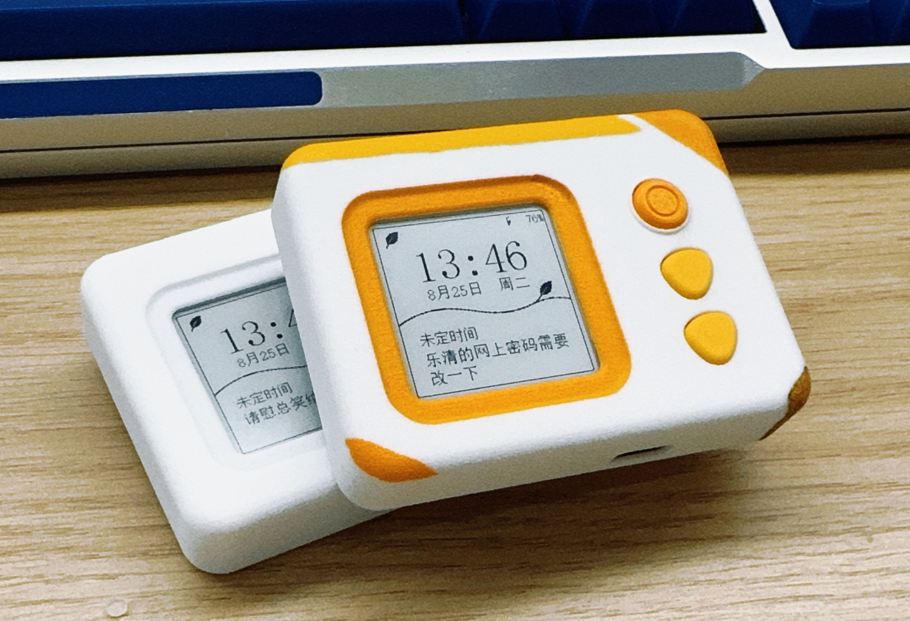
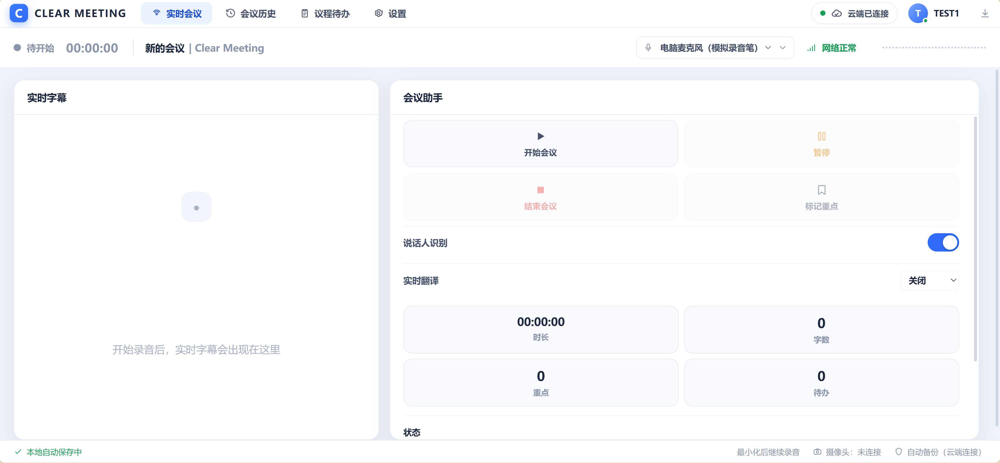
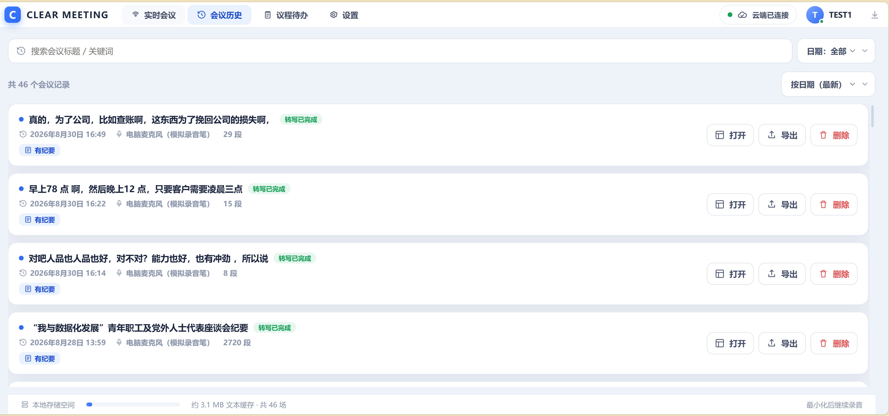
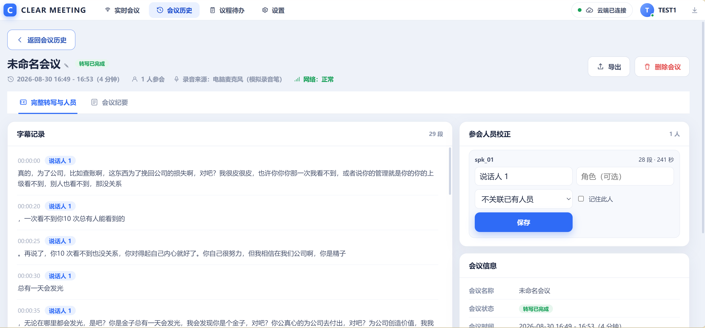
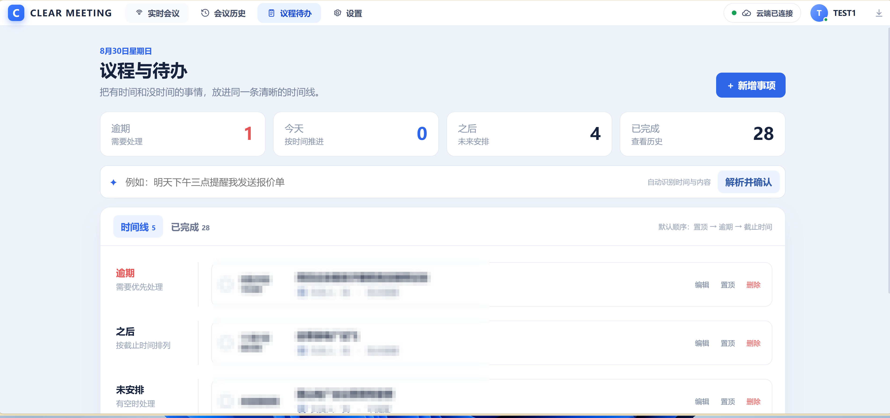
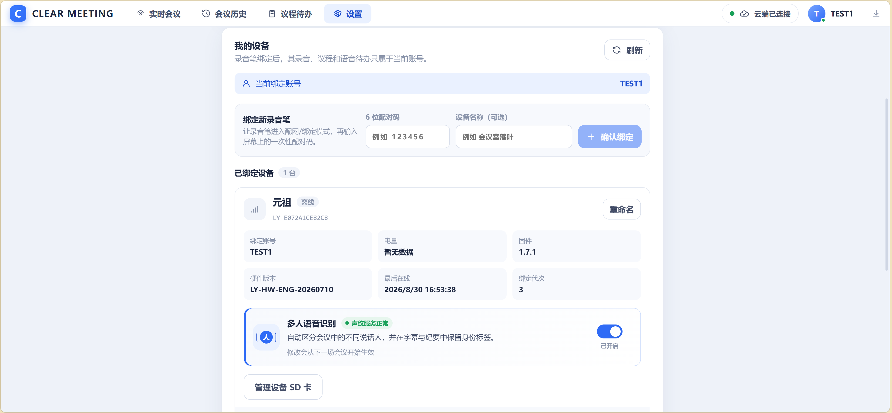
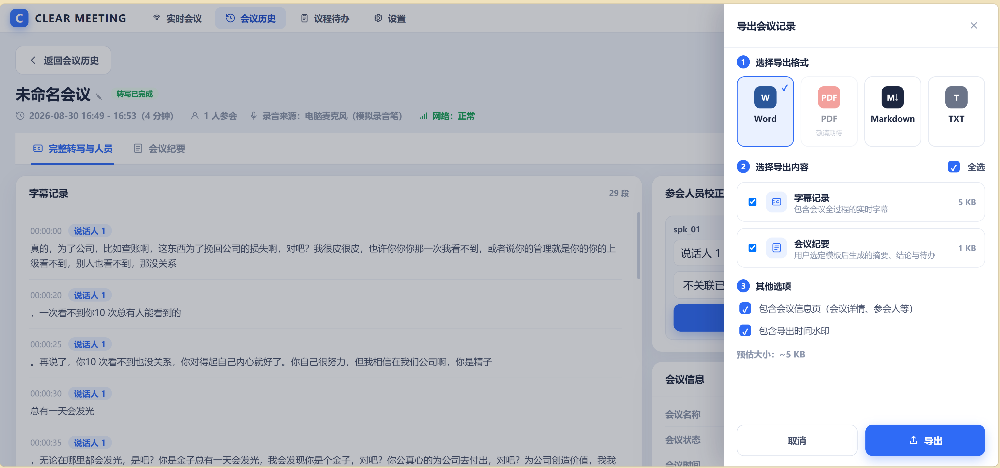

# 落叶（Luoye）录音卡---会议纪要录音卡
起因是我觉得钉TALK太贵了，这么个玩意儿自己做一个得了，结果就是漫长的三个月。
这也是我第一个全自研（AI助力）的项目，希望您能喜欢。
落叶是一套以 ESP32-S3、1.54 英寸电子墨水屏、双麦克风和 microSD 为核心的录音卡系统。设备负责可靠录音、离线保存、实时字幕显示与断点补传；ClearMeeting 负责转写、多人识别、会议纪要、待办和网页管理。

## 项目预览

<p align="center">
  
</p>

| 桌面使用 | 实机操作 |
| :---: | :---: |
|  |  |

以上为当前 3D 打印外壳的工程样机实拍。

## 当前兼容基线

| 组件 | 版本/标识 | 说明 |
| --- | --- | --- |
| 固件 | `2.0.0 stable-sdspi R1` | 由已验证的 `1.7.2` 稳定基线重新编号 |
| 服务器 | `2.0.0 stable R1` | 由 `0.21.0-upload-progress-r9` 稳定基线重新编号 |
| 设备 API | `luoye-device-api/2` | 固件与服务器的兼容边界 |
| 硬件 | `LY-HW-ENG-20260710` | 当前工程样机，尚未形成量产归档 |

详细变化和验证要求见 [发布兼容矩阵](docs/RELEASE_COMPATIBILITY.md)。

## ClearMeeting 网页

| 实时会议 | 会议历史 |
| :---: | :---: |
|  |  |

| 完整转写与人员 | 议程与待办 |
| :---: | :---: |
|  |  |

| 设备管理 | 会议导出 |
| :---: | :---: |
|  |  |


## 主要能力

- 双 PDM 麦克风录音，16 kHz 单声道 PCM/WAV 先落 microSD。
- 断网、重启和手动退出后按服务器缺口继续补传。
- 电子墨水屏显示时钟、电量、录音状态、字幕、议程、提醒和语音待办。
- ClearMeeting 提供实时转写与翻译、整场离线规范化、多人识别和模板化会议纪要。
- 设备与网页共享账号隔离、幂等会话、SD 管理和后台处理状态。
- 固件、服务器、PCB 与机械结构在同一仓库记录兼容关系。

## 使用说明

### 产品的基本使用流程

1. 在自己的服务器上部署 ClearMeeting，复制 `.env.example` 为 `.env`，填写账号密钥、AI 服务密钥和自己的 HTTPS 地址。
2. 给录音卡插入 FAT32 microSD 卡并开机；首次使用时按屏幕提示完成 Wi-Fi 配网，然后在网页“设置”中输入六位配对码绑定设备。
3. 使用录音键开始或结束录音。音频先可靠写入 SD 卡，联网时同步到服务器；断网时继续本地录音，恢复网络后按服务端缺口续传。
4. 录音期间可在墨水屏和网页查看实时文字；启用翻译后，还可同步查看目标语言内容。
5. 会议结束后，在网页历史记录中查看完整转写、说话人、纪要和待办，并导出 Word、Markdown 或文本。

### 录音卡功能

- 双麦克风采集、16 kHz WAV 本地保存，断网、复位和中途退出后可继续补传。
- 电子墨水屏显示时间、电量、录音时长、实时文字、翻译、滚动纪要、议程与提醒。
- 待机期间以 RTC 保持离线到点提醒；联网唤醒后同步日程和待办。
- 录音与上传使用独立的持久化状态，上传不会清空日程数据。
- microSD 异常、服务器状态和上传进度均有诊断日志，便于通过 USB 串口排查。

### ClearMeeting 网页功能

- 账号登录、录音卡配对、在线状态与 SD 卡管理。
- 浏览器直接发起会议，或接收录音卡上传的在线/离线会议。
- 实时字幕、实时翻译、完整离线定稿和多人说话人识别。
- 会议历史检索、纪要模板、待办提取、时间线、人员校正和多格式导出。
- 日历式议程与待办同步，可创建有时间或无时间的提醒事项。

### 典型场景

- **会议与访谈**：可靠录音、实时字幕、会后定稿、说话人区分和纪要导出。
- **外文课堂**：把实时转写与翻译显示在网页或录音卡上，作为随身课堂字幕/翻译设备。
- **课程表提醒**：利用和日历系统关联的议程与待办，把课程安排同步到录音卡，并由 RTC 离线提醒。
- **讲座与学习整理**：长时间录音后自动形成可检索文字、重点和后续任务。

按键、烧录、串口诊断和开发构建的详细说明见 [固件使用文档](firmware/README.md)；部署和环境变量见 [服务器使用文档](server/README.md)。

## 数据流

```text
双麦克风 → ESP32-S3 → microSD/WAV → luoye-device-api/2 → ClearMeeting
               ↓                              ↓
          电子墨水屏                    转写 / 多人识别
                                             ↓
                                      纪要 / 待办 / 导出
```

## 仓库结构

```text
firmware/             ESP32-S3 固件源码、构建检查和诊断工具
server/               ClearMeeting 服务端、Web 前端与部署文件
hardware/pcb/         主板/双麦板原理图与 EPRO 工程
hardware/mechanical/  外壳、内壳、底壳和按钮 STEP
docs/                 跨组件版本、制造与发布说明
scripts/              发布前仓库审计
```

## 快速开始

- 固件编译、烧录和串口诊断：[firmware/README.md](firmware/README.md)
- 服务器部署与验证：[server/README.md](server/README.md)
- PCB 与机械资料：[hardware/README.md](hardware/README.md)
- GitHub 发布前检查：[docs/GITHUB_PUBLISH_CHECKLIST.md](docs/GITHUB_PUBLISH_CHECKLIST.md)

## 隐私与部署配置

- 仓库不内置作者的 DeepSeek API Key、个人服务器域名/IP、Wi-Fi 名称、账号密码或设备令牌。
- `DEEPSEEK_API_KEY`、CORS 来源和公开服务地址只在本地 `.env` 或构建参数中配置；`.env` 已被 Git 忽略。
- 固件公开源码默认使用不可路由的 `https://meeting.example.invalid`。构建前必须用 `-ServerBaseUrl https://你的域名` 指定自己的服务。
- 如需同一 Wi-Fi 下走局域网服务器，可同时设置 `LUOYE_LAN_WIFI_SSID` 与 `LUOYE_LAN_SERVER_BASE_URL`；公开源码中的默认值为空。

## 版本和发布

源码仓库不提交烧录包、服务端压缩包、数据库、录音或密钥。二进制发布附件使用独立组件标签：

- `firmware-v2.0.0`
- `server-v2.0.0`

固件当前仍按 Engineering 版本发布。正式量产前必须完成真机长录音、跨 10 MiB 边界、上传中断恢复、SD 故障和重复复位验证。

## 工程边界

- 当前硬件资料属于自研样机。不能直接作为生产或开模依据；详见 [制造归档检查](docs/MANUFACTURING_STATUS.md)。
- 工程部署仍可显式使用 HTTP；真实账号、设备令牌和真实录音必须改用 HTTPS。
- 当前未选择开源许可证。在加入 `LICENSE` 前，代码和设计资料默认保留全部权利。
