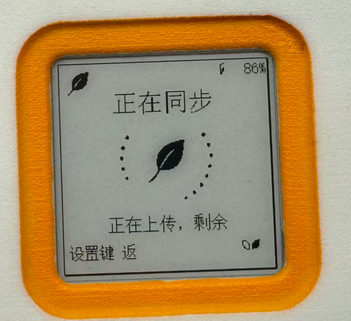
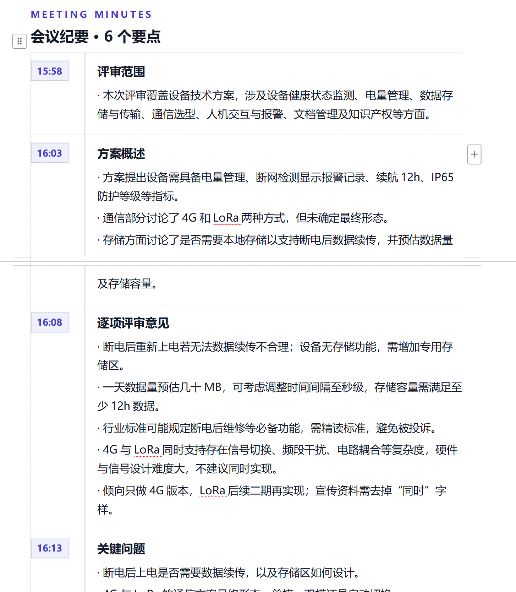

# 落叶（Luoye）录音卡

落叶是一套以 ESP32-S3、1.54 英寸电子墨水屏、双麦克风和 microSD 为核心的录音卡系统。设备负责可靠录音、离线保存、实时字幕显示与断点补传；ClearMeeting 负责转写、多人识别、会议纪要、待办和网页管理。

## 项目预览

| 落叶录音卡 | ClearMeeting 会议纪要 |
| :---: | :---: |
|  |  |
| 电子墨水屏显示录音、同步、电量、时间、待办与提醒 | 可靠音频完成后生成规范转写，并按模板整理会议纪要 |

## 当前兼容基线

| 组件 | 版本/标识 | 说明 |
| --- | --- | --- |
| 固件 | `1.7.0 R2` | ESP-IDF 5.5.4，单任务上传与精确 SDSPI DMA 路径 |
| 服务器 | `0.21.0 R9` | ClearMeeting 服务端、Web 前端与后台处理进度 |
| 设备 API | `luoye-device-api/2` | 固件与服务器的兼容边界 |
| 硬件 | `LY-HW-ENG-20260710` | 当前工程样机，尚未形成量产归档 |

详细变化和验证要求见 [发布兼容矩阵](docs/RELEASE_COMPATIBILITY.md)。

## 主要能力

- 双 PDM 麦克风录音，16 kHz 单声道 PCM/WAV 先落 microSD。
- 断网、重启和手动退出后按服务器缺口继续补传，逻辑范围保持 10 MiB。
- 电子墨水屏显示时钟、电量、录音状态、字幕、议程、提醒和语音待办。
- ClearMeeting 提供实时转写、整场离线规范化、多人识别和模板化会议纪要。
- 设备与网页共享账号隔离、幂等会话、SD 管理和后台处理状态。
- 固件、服务器、PCB 与机械结构在同一仓库记录兼容关系。

## 数据流

```text
双麦克风 → ESP32-S3 → microSD/WAV → luoye-device-api/2 → ClearMeeting
               ↓                              ↓
          电子墨水屏                    转写 / 多人识别
                                             ↓
                                      纪要 / 待办 / 导出
```

## 仓库结构

```text
firmware/             ESP32-S3 固件源码、构建检查和诊断工具
server/               ClearMeeting 服务端、Web 前端与部署文件
hardware/pcb/         PCB 工程、BOM 和装配模型
hardware/mechanical/  外壳机械文件
docs/                 跨组件版本、制造与发布说明
scripts/              发布前仓库审计
```

## 快速开始

- 固件编译、烧录和串口诊断：[firmware/README.md](firmware/README.md)
- 服务器部署与验证：[server/README.md](server/README.md)
- PCB 与机械资料：[hardware/README.md](hardware/README.md)
- GitHub 发布前检查：[docs/GITHUB_PUBLISH_CHECKLIST.md](docs/GITHUB_PUBLISH_CHECKLIST.md)

## 版本和发布

源码仓库不提交烧录包、服务端压缩包、数据库、录音或密钥。二进制发布附件使用独立组件标签：

- `firmware-v1.7.0`
- `server-v0.21.0`

固件当前仍按 Engineering 版本发布。正式量产前必须完成真机长录音、跨 10 MiB 边界、上传中断恢复、SD 故障和重复复位验证。

## 工程边界

- 当前硬件资料属于工程样机；PCB、BOM、装配 STEP 和外壳 STEP 尚未完全锁版，生产前必须完成 [制造归档检查](docs/MANUFACTURING_STATUS.md)。
- 工程部署仍可显式使用 HTTP；真实账号、设备令牌和真实录音必须改用 HTTPS。
- 当前未选择开源许可证。在加入 `LICENSE` 前，代码和设计资料默认保留全部权利。
