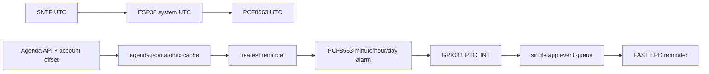

# 落叶 v0.6.1 议程、提醒与语音待办设计

固件版本：`0.6.1-cloud-v1`
设备 API：`luoye-device-api/1`
目标硬件：`LY-HW-ENG-20260710` / ESP32-S3 / PCF8563 / 固定式 SD

## 1. 完成边界

本版本在设备端一次性完成：SNTP/RTC UTC 校时、账号时区显示、revision 议程同步、
原子缓存、最近提醒调度、关机态到点唤醒、提醒三种操作、MARK 语音旁路、断网持久化、
幂等上传、服务端结果确认以及账号代际隔离。

ASR、自然语言时间解析、账号日历写入和跨客户端同步在服务器完成。固件不内置语音
模型，也不接收账号密码。API v1 两端实现已统一，云端闭环仍需真板端到端验收。

## 2. 时间与提醒信息流

- RTC、系统时间、议程时间戳全部存 UTC；`timezone_offset_minutes` 只用于墨水屏显示。
- 联网收到 SNTP 后先校准 PCF8563，再重新调度最近提醒。
- 若系统时间早于 2020 年，已通过设备鉴权且 generation 有效的议程响应
  `server_time_utc` 可作为无公网 NTP 环境的启动校时源，并同步写入 PCF8563；
  正常时钟不做覆盖。
- `agenda.json` 使用 `tmp → fsync → rename`，保留 `.bak` 作为损坏回退。
- 提醒页：REC 以议程标题开始会议；MARK 推迟 10 分钟；BACK 确认关闭。
- 录音安全收尾或语音待办采集期间到达的提醒进入状态机待处理槽，不覆盖收尾/采集。

PCF8563 闹钟没有月份字段，因此固件固定请求未来 7 天完整滚动窗口。

## 3. 当前 PCB 的低功耗兼容方案

GPIO41 不是 RTC-IO，无法从 ESP32-S3 deep sleep 唤醒。设备存在已编程提醒时使用
GPIO light sleep，只开放 `RTC_INT` 和 REC 唤醒；长按 REC 仍需持续 3 秒。没有提醒时
继续使用 deep sleep。此方案无需改板，但有提醒期间必须在真板测量静态电流。

## 4. 语音待办信息流

- PDM tap 位于主 WAV 静音判断之前，因此主录音暂停时仍能录待办。
- 主录音进行中复用同一 PDM 流；待机时临时开启麦克风和低噪声电源模式。
- 本地路径：`/sdcard/todo/<client_todo_id>/audio.wav` 与 `todo.json`。
- 采集过程中每累计 64 KiB 执行一次 `fflush + fsync`；若异常断电，开机扫描
  `capturing` 条目、按已有 PCM 长度修复 WAV 头，并恢复为待上传队列。
- 状态：`capturing → queued → uploaded → needs_confirmation → confirm_pending → created`；
  取消与永久失败分别持久化为 `cancelled`、`failed`。
- 每次传输失败均保留音频；只有服务端动作 ACK 后才显示“已创建”。
- 确认/取消 action 携带结果 revision 和稳定幂等键；服务器返回
  `TODO_REVISION_MISMATCH` 时重新拉取结果，不能把过期操作当成功。

## 5. 账号隔离

议程和待办都绑定 NVS 中的 `binding_generation`：

- 议程响应 generation 不一致时整包拒绝。
- 解绑或 Token 失效立即清除议程缓存和 RTC 闹钟。
- SD 中旧 generation 待办保留，但新账号不会扫描、显示、上传或确认。
- 服务器仍必须从 Device Token 确定 owner，不能信任设备自报账号。

## 6. 墨水屏与按键

- 待机第 1 页：时钟、账号时区、下一项议程。
- 待机第 2 页：最多四条后续议程。
- 待机第 3 页：网络、云端、绑定、积压、存储、充电和版本。
- 所有产品刷新统一调用 `epd_frame_fast()`；录音字幕 15 秒刷新，待机时钟每分钟刷新。
- 待办流程区分“本地已保存”“等待确认”“已创建”“处理失败”，不以 WiFi 在线冒充云端完成。

## 7. 验证门禁

- `run_agenda_protocol_test.bat`：UTF-8、revision/generation、最近/到期提醒和查询游标。
- `run_state_test.bat`：待机三页、待办采集/确认、RTC 竞态和安全收尾延迟显示。
- `run_agenda_todo_static_checks.ps1`：原子持久化、账号隔离、RTC、音频旁路与全 FAST。
- ESP-IDF v5.5.4 clean build、release manifest、SHA-256 与解压复验。

真板仍需验证：SNTP 写 RTC、离线关机到点唤醒、+10 分钟、30 秒待办、录音中待办、
复位后补传、两账号交叉隔离，以及有提醒/无提醒两种关机电流。
