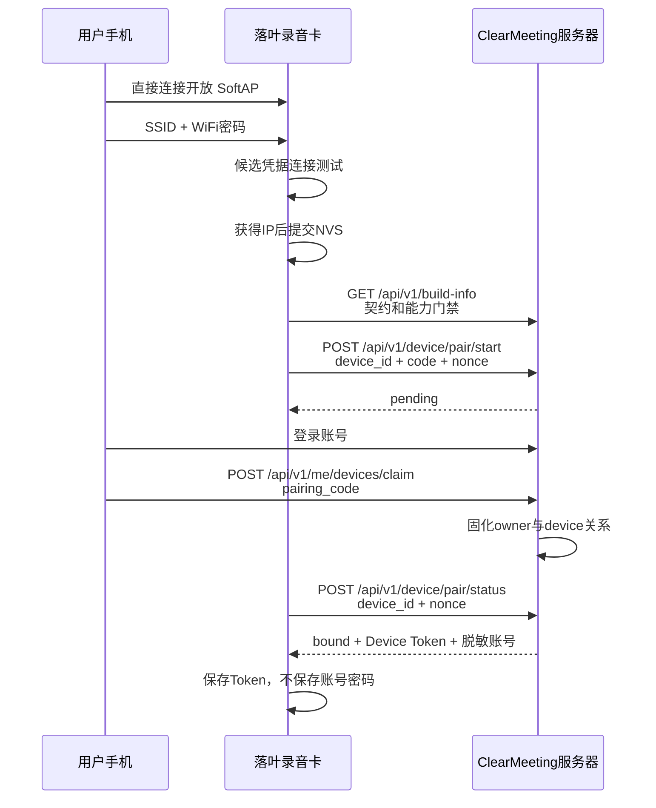

# 落叶 v0.6.1 配网与账号绑定设计

状态：`API V1 IMPLEMENTED / END-TO-END PENDING`

适用固件：`0.6.1-cloud-v1`

API 契约：`luoye-device-api/1`

## 1. 产品边界

- 落叶自身的 `LUOYE-XXXX` 配网热点为开放网络，不设置热点密码。
- 录音卡只接收并保存目标 2.4 GHz WiFi 的名称和密码；目标网络开放时密码可留空。
- SoftAP 页面不出现账号、账号密码、用户 ID 或服务器地址输入框。
- 服务器地址由固件固定，用户不能把设备引向任意服务器。
- 用户在 ClearMeeting 网页或客户端登录，然后用一次性配对码认领设备。
- 设备只保存服务器签发的可撤销 Device Token 和脱敏账号名。
- 未取得 Device Token 时，不上传会话元数据或音频。
- WiFi、服务器、绑定和录音存储是四个独立状态；任何联网故障都不能阻止本地录音。

## 2. 用户流程

1. 待机状态长按 `BACK` 3 秒。
2. 墨水屏显示开放热点 `LUOYE-XXXX`、“无需密码”和 `192.168.4.1`。
3. 手机连接热点，打开 `http://192.168.4.1/`。
4. 页面扫描并选择 2.4 GHz WiFi，只填写 WiFi 密码。
5. 设备先用候选凭据连接；只有获得 IP 后才原子写入 NVS。
6. 设备通过固定 HTTPS 服务器登记一次性配对码。
7. 用户断开设备热点，在 ClearMeeting 登录自己的账号并输入配对码。
8. 设备轮询同一个 nonce；服务器确认认领后返回 Device Token 和脱敏账号。
9. 设备原子保存绑定结果，自动关闭 HTTP portal/SoftAP、切回 STA 并返回正常页面。

已绑定设备再次主动进入配对时允许原账号认领并轮换 token；旧 token 在新 token
成功持久化前继续有效，轮换后的 `binding_generation` 必须保持不变。其他账号不能
借此转移设备，必须先由原账号解绑。

Device Token 返回 `401/403` 时，设备保留 WiFi，清除失效 token，生成新的
`pairing_code + nonce` 并自动回到账号认领页；旧 binding generation 的本地录音
不会上传到新账号。当本机时间早于 2020 年时，已认领的
`pair/status.server_time` 可一次性校准系统时间并回写 PCF8563；有效本机时间不会被
该兜底路径覆盖。

为解决空白板 1970 时钟无法验证首个 HTTPS 证书的问题，SoftAP 页面提交时用隐藏
字段携带浏览器当前 Unix UTC。固件只接受 2020..2099 的严格十进制秒数，只在
本机早于 2020 时 `settimeofday` 并同步 PCF8563；已有有效 RTC 不受浏览器影响。
字段缺失不会阻断旧浏览器配网，HTTPS 门禁会等待 SNTP 后再发起 API。

## 3. 信息流



## 4. 设备身份

工程版使用完整 eFuse WiFi MAC 生成稳定 ID：

```text
LY-AABBCCDDEEFF
```

它比旧版 `REC-XXXX` 后四位身份可靠，但仍是工程过渡方案。量产前必须烧录独立
`device_uuid` 和设备密钥，不能仅依赖 MAC。

## 5. NVS 数据

命名空间：`net`

| Key | 内容 | 写入时机 |
|---|---|---|
| `ssid` | WiFi SSID | 候选网络获得 IP 后 |
| `pass` | WiFi 密码 | 与 SSID 同一次 commit |
| `token` | 可撤销 Device Token | 服务器返回 bound 后 |
| `account` | 脱敏账号 | 与 token 同一次 commit |
| `binding_gen` | 当前 `binding_generation` | 与 token 同一次 commit |

当前 dev.1 工程包尚未启用 NVS 加密，只允许工程测试；不得作为生产安全版本。

## 6. 状态机

```text
IDLE
  -> AP_READY
  -> WIFI_CONNECTING
  -> WIFI_CONNECTED
  -> CLAIM_PENDING
  -> BOUND

任一步失败 -> ERROR
BACK -> IDLE
```

串口只输出状态、HTTP 状态码和错误码，不输出热点密码、WiFi 密码、配对 nonce、
Device Token 或账号内容。

## 7. 固定式 SD 交互

设备没有用户可插拔 SD 卡，因此固件界面删除：

- 请插入 SD 卡
- 插卡后重试
- 请勿拔卡
- 更换 SD 卡
- 检查卡座

统一显示：

- `存储不可用`
- `存储空间已满`
- `录音未保存`
- `正在保护录音文件`

“请勿断电”仍保留在安全收尾页，因为它是用户可执行且影响文件闭合的操作。

## 8. 当前验收点

ClearMeeting v0.12.0 与固件已统一到 API v1。仍需用两组真实测试账号验证：配对码
过期/重放、同账号 token 轮换不增加代次、其他账号不能抢绑、解绑后旧 token 立即
失效、设备重启后 NVS 绑定恢复。完成这些项目以前状态保持端到端待验收。
